# 👋 Hi, I'm Harsha Vardhanu Parnandi

<div align="center">


[](https://harshajustin.me)
[](https://www.linkedin.com/in/harshavardhanuparnandi/)
[](https://github.com/harshajustin)
[](https://leetcode.com/u/22eg107a47/)

</div>

## 🎓 About Me

🚀 **B.Tech Student** in **Artificial Intelligence & Machine Learning** at **Anurag University**  
💡 **AI/ML Enthusiast** with expertise in **Generative AI**, **NLP**, and **Cloud Technologies**  
🌟 **Problem Solver** passionate about building impactful applications that make a difference  
🔥 **Innovation Leader** with hands-on experience in cutting-edge AI technologies  

---

## 🛠️ Technical Arsenal

<div align="center">

### 💻 Programming Languages


### 🤖 AI/ML Frameworks & Tools


### ☁️ Cloud & Devops


### 📊 Data & Analytics


### 🛠️ Enterprise Platforms


</div>

---

## 🚀 Featured Projects

<div align="center">

### 🤖 [EduBot – Real-Time Information Retrieval Chatbot](https://github.com/7FD-Visionova/Edubot)
**🏆 1st Place Winner - AI Days Hackathon**

</div>

```yaml
🎯 Purpose: Semantic AI chatbot for college websites
🔥 Impact: Automated info retrieval for 500+ students
🧠 Tech Stack: BERT, PostgreSQL, Gemini 1.5 Flash API
⚡ Features: Real-time responses, semantic search, scalable architecture
```

<div align="center">

### 📝 [ATS Resume Expert](https://github.com/harshajustin/ATS-Resume-Expert)
**AI-Powered Resume Analysis & Optimization Tool**

</div>

```yaml
🎯 Purpose: Intelligent resume analysis and optimization
🔥 Impact: 85% improvement in engagement rate
🧠 Tech Stack: NLP, OpenAI API, Machine Learning
⚡ Features: ATS scoring, personalized feedback, cold email generation
```

---

## 📈 GitHub Analytics

<div align="center">


</div>

---

## 🎓 Academic Excellence

<table align="center">
<tr>
<td align="center" width="50%">

### 📚 Core Coursework
- 🧠 **Natural Language Processing (NLP)**
- 🤖 **Generative AI & Transformers**
- 📊 **Data Analysis & Visualization**
- 📈 **Applied Statistics for ML**
- 🔧 **Git & Version Control Systems**
- ☁️ **Cloud Computing & DevOps**

</td>
<td align="center" width="50%">

### 🏆 Certifications
- 🎓 **Generative AI with Langchain & Hugging Face**
- 🛠️ **ServiceNow CSA & CAD Certified**
- 📊 **Power BI Data Analytics**
- 🐍 **Python for Data Science**
- ☁️ **AWS Cloud Practitioner** *(In Progress)*

</td>
</tr>
</table>

---

## 🏆 Leadership & Achievements

<div align="center">

| 🏅 Achievement | 📝 Description | 👥 Impact |
|:-------------:|:-------------:|:---------:|
| 🥇 **AI Days Hackathon Winner** | Built & deployed EduBot chatbot | 500+ students |
| 🎯 **Open Source Contributor** | Active GitHub contributions | Developer community |

</div>

---

## 🔬 Current Focus

```mermaid
graph TD
    A[🔭 Current Work] --> B[RAG Pipelines]
    A --> C[AI Agents]
    A --> D[Cloud Deployment]
    
    B --> E[🧠 Advanced NLP]
    C --> F[🤖 Autonomous Systems]
    D --> G[☁️ Scalable Infrastructure]
    
    E --> H[🚀 Production Ready]
    F --> H
    G --> H
```

<div align="center">



</div>

🔭 **Currently Working On:**
- 🧠 Scaling AI agents with advanced RAG (Retrieval-Augmented Generation) pipelines
- ☁️ Deploying intelligent systems using cutting-edge cloud platforms
- 🤖 Building autonomous AI solutions for real-world applications
- 📚 Contributing to open-source AI/ML projects

---

## 📊 Weekly Development Breakdown

<!--START_SECTION:waka-->
```text
Python       12 hrs 30 mins  ████████████████▓░░░░  65.2%
JavaScript    3 hrs 45 mins  ████▒░░░░░░░░░░░░░░░░  19.6%
SQL           1 hr 20 mins   █▒░░░░░░░░░░░░░░░░░░░   7.0%
Docker        45 mins        ▒░░░░░░░░░░░░░░░░░░░░   3.9%
YAML          30 mins        ▒░░░░░░░░░░░░░░░░░░░░   2.6%
Other         25 mins        ▒░░░░░░░░░░░░░░░░░░░░   1.7%
```
<!--END_SECTION:waka-->

---

## 📫 Let's Connect & Collaborate!

<div align="center">

<table>
<tr>
<td align="center" width="25%">

[](mailto:harshajustin2@gmail.com)
**Personal**

</td>
<td align="center" width="25%">

[](https://www.linkedin.com/in/harshavardhanuparnandi/)
**Professional**

</td>
<td align="center" width="25%">

[](https://leetcode.com/u/22eg107a47/)
**Coding Practice**

</td>
<td align="center" width="25%">

[](https://harshajustin.me)
**Showcase**

</td>
</tr>
</table>

### 🤝 Open for Collaboration
- 🚀 **AI/ML Projects** - Generative AI, NLP, Computer Vision
- 🌐 **Full-Stack Development** - React, Node.js, Python backends
- ☁️ **Cloud Solutions** - AWS, Azure, Scalable deployments
- 📊 **Data Science** - Analytics, Visualization, ML Pipelines

</div>

---

<div align="center">

### 💡 Fun Fact
*I believe that the best way to predict the future is to build it with AI! 🤖✨*


**⭐ If you like my work, please consider giving a star to my repositories!**

</div>

---

<div align="center">

*"Innovation distinguishes between a leader and a follower. I choose to lead through AI."* 🚀

[](https://github.com/piyushsuthar/github-readme-quotes)

</div>
